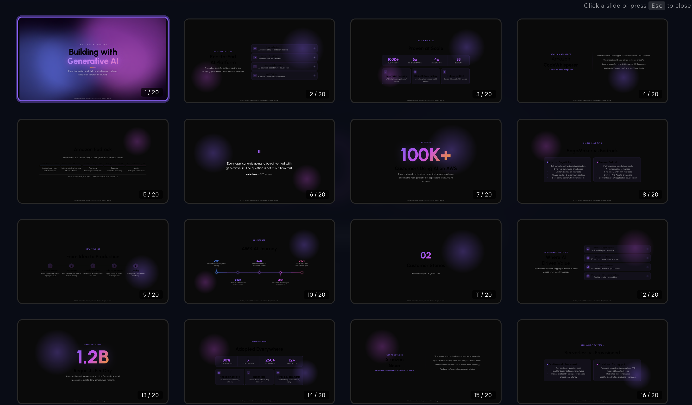

<a href="#english">English</a> | <a href="#中文">中文</a>

---

<a id="english"></a>

# aws-html-slides

An agent skill for creating stunning, animation-rich HTML presentations — from scratch or by converting PowerPoint files.

Based on [@zarazhangrui](https://github.com/zarazhangrui)'s [frontend-slides](https://github.com/zarazhangrui/frontend-slides).

### Demo: re:Invent Keynote (Style #2)

https://github.com/user-attachments/assets/c264cc34-67d5-4cbd-a884-9c1b20d06f7a

### Demo: Neon Cyber (Style #1)

https://github.com/user-attachments/assets/54dfbf37-7a7a-44e1-ad7e-585b99e9c77a

## What This Does

**aws-html-slides** helps non-designers create beautiful web presentations without knowing CSS or JavaScript. Instead of asking you to describe your aesthetic preferences in words, it provides **2 pre-built visual previews** and lets you pick what you like.

## Key Features

- **Zero Dependencies** — Single HTML files with inline CSS/JS. No npm, no build tools, no frameworks.
- **Visual Style Discovery** — Browse 2 curated specialty styles (Neon Cyber, re:Invent Keynote) and pick by preview.
- **Rich Layouts** — re:Invent Keynote ships ~18 keynote-grade content layouts (refined framed slides, metric cards with deltas, tagged card grids, numbered outlook columns, and more) so long decks never look monotonous.
- **Experimental 3D & Motion Effects** — Optional, self-contained, offline effects for **both specialty styles**: CSS 3D, pointer-driven tilt, WebGL shader backgrounds, GSAP kinetic type (plus Three.js for re:Invent). Each ships in a re:Invent purple tint and, for four of them, a Neon Cyber cyan tint. See [3D & Motion Effects](#3d--motion-effects-experimental) below.
- **PPT Conversion** — Convert existing `.pptx` files to web presentations, preserving images, text, and notes.
- **Anti-AI-Slop** — Distinctive styles that avoid generic AI aesthetics. Custom fonts, curated palettes, purposeful animations.
- **Chart.js Support** — Embed responsive charts (line, bar, doughnut, pie, radar, polar) directly in slides using simple markdown syntax — auto-themed to match your chosen style.
- **Diagram Support** — Draw flowcharts, AWS architecture diagrams, sequence/UML/ER, network topology, or mind maps via the [drawio-skill](https://github.com/Agents365-ai/drawio-skill). Just describe the diagram in plain language in `content.md` — the skill generates and embeds a PNG automatically.
- **Tables & Media Lightbox** — Themed comparison tables from plain markdown, plus click-to-enlarge lightbox for any image or diagram.
- **Inline Editing** — Press `E` to edit text directly in the browser, `Esc` to save.
- **Save to File** — `Cmd/Ctrl+S` writes your edits back into the source `index.html`. No more "lost on cache clear" — edits become permanent changes to the file itself. Chrome / Edge only (uses the File System Access API).
- **Overview Mode** — Press `Esc` (when not editing) to open a PPT-style grid of all slide thumbnails. Click any thumbnail — or use arrow keys + Enter — to jump. Current slide is highlighted.
- **Parallel Generation** — For 8+ slide decks, sub-agents generate slide batches in parallel for speed.

### Overview mode



## Installation

### Option 1: Clone and copy the skill folder

```bash
git clone https://github.com/lanceli93/aws-html-slides.git
cp -r aws-html-slides/aws-html-slides ~/.claude/skills/aws-html-slides
```

### Option 2: Clone and symlink (easy to update)

```bash
git clone https://github.com/lanceli93/aws-html-slides.git ~/aws-html-slides
ln -s ~/aws-html-slides/aws-html-slides ~/.claude/skills/aws-html-slides
```

To update later, just `git pull` in the cloned repo.

## Usage

Invoke the skill in your AI IDE or agent:

```
/aws-html-slides
```

### Path 1: Create a New Presentation

```
Step 1  →  Setup (language, mode, editing, page count)
Step 2  →  Topic
Step 3  →  Pick a style from 2 previews
Step 4  →  Fill in content.md
Step 5  →  Generate HTML
```

Example:

```
/aws-html-slides

> "I want to create a pitch deck about Amazon Bedrock Agents"
```

The skill will:
1. Ask your preferences (language / mode / editing / page count) in one go
2. Show 2 style previews in Finder — pick by number
3. Generate a `content.md` template for you to fill in
4. Review your content and generate a self-contained HTML presentation

### Path 2: Convert a PowerPoint

```
Step 1  →  Setup (language, mode)
Step 2  →  Provide .pptx file path
Step 3  →  Pick a style (1-2) → auto-extract + generate (done)
```

Example:

```
/aws-html-slides

> "Convert my-talk.pptx to a web slideshow"
```

## Output

```
my-presentation/
├── index.html        # Self-contained presentation (all CSS/JS inline)
└── assets/           # Media files (auto-copied)
    ├── screenshot.png
    └── demo.mp4
```

- Navigate: Arrow keys, Space, scroll, or click nav dots
- Images: Click to enlarge, Esc to close
- Share: Zip the folder — recipient unzips and opens `index.html`

## Available Styles

| # | Style | Vibe | Theme |
|---|-------|------|-------|
| 1 | Neon Cyber | Futuristic, techy, neon glow, 3D-ready | Specialty |
| 2 | re:Invent Keynote | Futuristic, keynote-stage, high-tech, 3D-ready | Specialty |

**Neon Cyber** — black-and-neon aesthetic with cyan/magenta glow, scanlines, and grid. Best for technical, futuristic, or product-launch topics that want energy. Now supports the optional 3D/motion effects below in a cyan/magenta tint ([`demos/neon/`](demos/neon/)).

**re:Invent Keynote** — the most developed style, modeled on AWS keynote stages. Ships ~18 keynote-grade content layouts (refined framed slides, metric cards with deltas, tagged card grids, numbered outlook columns, process flows, timelines, big-number slides) so long decks never look monotonous, and it supports the optional 3D/motion effects below in its purple/pink tint.

## 3D & Motion Effects (Experimental)

Optional, **fully offline and self-contained** ways to add depth and motion to **either specialty style** — no CDN at runtime, libraries vendored locally. These are a deliberate, per-deck menu rather than the default flow; the lightweight CSS default stays the baseline. The palette-agnostic reference and its licensing red-lines live in [`aws-html-slides/effects-reference.md`](aws-html-slides/effects-reference.md). Each technique ships a working demo in the **re:Invent purple** tint under [`demos/`](demos/); four of them also ship a **Neon Cyber cyan** tint under [`demos/neon/`](demos/neon/):

| Technique | What it gives you | Purple demo | Neon demo |
|-----------|-------------------|-------------|-----------|
| **WebGL shader background** | Hand-written animated nebula shader behind the slide | [`demos/webgl-nebula/`](demos/webgl-nebula/) | [`demos/neon/webgl-nebula/`](demos/neon/webgl-nebula/) |
| **2D-canvas particles** | Lightweight constellation/network background, no WebGL | [`demos/particles-network/`](demos/particles-network/) | [`demos/neon/particles-network/`](demos/neon/particles-network/) |
| **Pointer tilt** | Cards that tilt toward the cursor with layered `translateZ` depth and a specular sheen | [`demos/pointer-tilt/`](demos/pointer-tilt/) | [`demos/neon/pointer-tilt/`](demos/neon/pointer-tilt/) |
| **GSAP kinetic type** | Orchestrated title reveals (GSAP 3.13, vendored) | [`demos/gsap-title/`](demos/gsap-title/) | [`demos/neon/gsap-title/`](demos/neon/gsap-title/) |
| **CSS 3D** | Pure-CSS rotating geometry + 2.5D parallax via `preserve-3d` / `perspective` — no JS library | [`demos/css-3d-hero/`](demos/css-3d-hero/) | — (re-tint) |
| **GSAP micro-motion** | Content micro-effects: number count-up, text scramble, SVG path-draw | [`demos/gsap-micro/`](demos/gsap-micro/) | — (re-tint) |
| **Three.js (real WebGL)** | Genuine 3D hero — emissive morphing core, fresnel rim, orbiting lights, inline bloom | [`demos/threejs-hero/`](demos/threejs-hero/) | — (purple only) |

[`demos/qa-runs/nova-core/`](demos/qa-runs/nova-core/) shows the 3D techniques integrated into one re:Invent deck, with per-slide animated backgrounds and an `IntersectionObserver` that runs each effect only while its slide is on screen.

> **Status:** these effects are not yet auto-wired into the default generation flow — you opt in per deck. The Neon Cyber set excludes Three.js by design (the CSS/WebGL/GSAP effects carry the look at a fraction of the weight). Licensing is documented up front (always-safe: Three.js, GSAP, tsParticles, lottie-web, Lucide; avoid Spline/Shadertoy/LYGIA for commercial use).

## Requirements

- An AI IDE or agent that supports skills (e.g. [Claude Code](https://claude.ai/claude-code))
- For PPT conversion: Python with `python-pptx` (auto-installed via `uv`)
- For diagrams (optional): [draw.io desktop app](https://github.com/jgraph/drawio-desktop/releases) CLI on PATH (`brew install --cask drawio`) and the [drawio-skill](https://github.com/Agents365-ai/drawio-skill) installed

## License

MIT — See [LICENSE](LICENSE) for details.

---

<a id="中文"></a>

# aws-html-slides

一个 Agent 技能，用于创建精美的、动画丰富的 HTML 演示文稿 —— 支持从零开始创建或从 PowerPoint 文件转换。

基于 [@zarazhangrui](https://github.com/zarazhangrui) 的 [frontend-slides](https://github.com/zarazhangrui/frontend-slides) 项目。

### 演示：re:Invent Keynote（风格 #2）

https://github.com/user-attachments/assets/c264cc34-67d5-4cbd-a884-9c1b20d06f7a

### 演示：Neon Cyber（风格 #1）

https://github.com/user-attachments/assets/54dfbf37-7a7a-44e1-ad7e-585b99e9c77a

## 这是什么

**aws-html-slides** 帮助非设计师在不了解 CSS 或 JavaScript 的情况下创建漂亮的网页演示文稿。它不要求你用文字描述审美偏好，而是提供 **2 个预构建的视觉预览**，让你直接挑选喜欢的风格。

## 核心特性

- **零依赖** —— 单个 HTML 文件，内联所有 CSS/JS。无需 npm、构建工具或框架。
- **视觉化风格发现** —— 浏览 2 种精选特色风格（Neon Cyber、re:Invent Keynote），通过预览选择。
- **丰富排版** —— re:Invent Keynote 内置约 18 种主题演讲级内容排版（精致边框页、带涨跌的指标卡、标签卡片网格、编号展望栏等），长篇幻灯片不再单调。
- **实验性 3D 与动效** —— **两种特色风格**均可选用自包含、离线可用的特效：CSS 3D、跟随鼠标的倾斜、WebGL shader 背景、GSAP 动态文字（re:Invent 另含真实 Three.js）。每种特效都提供 re:Invent 紫色配色版本，其中四种还提供 Neon Cyber 青色配色版本。详见下方 [3D 与动效](#3d-与动效实验性)。
- **PPT 转换** —— 将已有的 `.pptx` 文件转换为网页演示文稿，保留图片、文字和备注。
- **拒绝 AI 味** —— 独特的设计风格，避免千篇一律的 AI 审美。定制字体、精选配色、有目的的动画。
- **Chart.js 图表支持** —— 通过简单的 Markdown 语法直接在幻灯片中嵌入响应式图表（折线、柱状、环形、饼图、雷达、极坐标），并自动套用所选风格的配色。
- **架构图/流程图支持** —— 通过 [drawio-skill](https://github.com/Agents365-ai/drawio-skill) 绘制流程图、AWS 架构图、时序/UML/ER 图、网络拓扑或思维导图。在 `content.md` 中用自然语言描述即可，技能会自动生成并嵌入 PNG 图片。
- **表格与媒体灯箱** —— 用纯 Markdown 生成套用主题配色的对比表格，图片和架构图均支持点击放大灯箱。
- **浏览器内编辑** —— 按 `E` 进入编辑模式直接修改文字，按 `Esc` 保存。
- **保存到源文件** —— `Cmd/Ctrl+S` 把编辑内容直接写回源 `index.html` 文件，不再"清缓存就丢失"，编辑真正成为文件本身的持久修改。仅支持 Chrome / Edge（基于 File System Access API）。
- **概览模式** —— 非编辑状态下按 `Esc` 打开类似 PPT 的缩略图网格。点击任意缩略图，或用方向键 + Enter，即可跳转到对应页，当前页高亮显示。
- **并行生成** —— 8 页以上的演示文稿，多个子代理并行生成幻灯片批次，提升速度。

### 概览模式


## 安装

### 方式一：克隆后复制技能文件夹

```bash
git clone https://github.com/lanceli93/aws-html-slides.git
cp -r aws-html-slides/aws-html-slides ~/.claude/skills/aws-html-slides
```

### 方式二：克隆后创建符号链接（便于更新）

```bash
git clone https://github.com/lanceli93/aws-html-slides.git ~/aws-html-slides
ln -s ~/aws-html-slides/aws-html-slides ~/.claude/skills/aws-html-slides
```

后续更新只需在克隆目录中执行 `git pull`。

## 使用方法

在你的 AI IDE 或 Agent 中调用技能：

```
/aws-html-slides
```

### 路径一：创建新演示文稿

```
步骤 1  →  设置（语言、模式、编辑功能、页数）
步骤 2  →  主题
步骤 3  →  从 2 个预览中选择风格
步骤 4  →  填写 content.md
步骤 5  →  生成 HTML
```

示例：

```
/aws-html-slides

> "我想创建一个关于 Amazon Bedrock Agents 的演讲"
```

技能将会：
1. 一次性询问你的偏好（语言 / 模式 / 编辑 / 页数）
2. 在 Finder 中展示 2 个风格预览 —— 输入编号选择
3. 生成 `content.md` 模板供你填写内容
4. 审查你的内容并生成自包含的 HTML 演示文稿

### 路径二：转换 PowerPoint

```
步骤 1  →  设置（语言、模式）
步骤 2  →  提供 .pptx 文件路径
步骤 3  →  选择风格（1-2）→ 自动提取 + 生成（完成）
```

示例：

```
/aws-html-slides

> "把我的 my-talk.pptx 转换成网页幻灯片"
```

## 输出结构

```
my-presentation/
├── index.html        # 自包含演示文稿（所有 CSS/JS 内联）
└── assets/           # 媒体文件（自动复制）
    ├── screenshot.png
    └── demo.mp4
```

- 导航：方向键、空格、滚动、或点击导航圆点
- 图片：点击放大，Esc 关闭
- 分享：打包整个文件夹为 zip —— 接收者解压后打开 `index.html` 即可

## 可选风格

| # | 风格 | 氛围 | 主题 |
|---|------|------|------|
| 1 | Neon Cyber | 未来感、科技、霓虹光效、支持 3D | 特色 |
| 2 | re:Invent Keynote | 未来感、主题演讲、高科技、支持 3D | 特色 |

**Neon Cyber** —— 黑底霓虹美学，青/品红辉光、扫描线和网格背景。适合技术、未来感或产品发布类、想要冲击力的主题。现也支持下方可选的 3D/动效（青/品红配色版，见 [`demos/neon/`](demos/neon/)）。

**re:Invent Keynote** —— 最完善的风格，仿照 AWS 主题演讲舞台。内置约 18 种主题演讲级内容排版（精致边框页、带涨跌的指标卡、标签卡片网格、编号展望栏、流程图、时间线、大数字页），长篇幻灯片不再单调；同样支持下方可选的 3D/动效（紫/粉配色版）。

## 3D 与动效（实验性）

为**两种特色风格**增加纵深与动感的可选方案，**完全离线、自包含** —— 运行时不依赖 CDN，所有库都本地内置。这些是按需逐个 deck 选用的菜单，而非默认流程；轻量的 CSS 默认效果仍是基线。配色无关的参考与授权红线见 [`aws-html-slides/effects-reference.md`](aws-html-slides/effects-reference.md)。每种技术在 [`demos/`](demos/) 下都有 **re:Invent 紫色**版本示例，其中四种另在 [`demos/neon/`](demos/neon/) 下提供 **Neon Cyber 青色**版本：

| 技术 | 效果 | 紫色示例 | 青色示例 |
|------|------|----------|----------|
| **WebGL shader 背景** | 手写的星云动画 shader 作为幻灯片背景 | [`demos/webgl-nebula/`](demos/webgl-nebula/) | [`demos/neon/webgl-nebula/`](demos/neon/webgl-nebula/) |
| **2D Canvas 粒子** | 轻量的星座/网络背景，无需 WebGL | [`demos/particles-network/`](demos/particles-network/) | [`demos/neon/particles-network/`](demos/neon/particles-network/) |
| **鼠标倾斜** | 卡片随鼠标倾斜，配合 `translateZ` 分层纵深与高光扫光 | [`demos/pointer-tilt/`](demos/pointer-tilt/) | [`demos/neon/pointer-tilt/`](demos/neon/pointer-tilt/) |
| **GSAP 动态文字** | 编排式标题入场（内置 GSAP 3.13） | [`demos/gsap-title/`](demos/gsap-title/) | [`demos/neon/gsap-title/`](demos/neon/gsap-title/) |
| **CSS 3D** | 纯 CSS 旋转几何体 + 通过 `preserve-3d` / `perspective` 实现的 2.5D 视差，无需 JS 库 | [`demos/css-3d-hero/`](demos/css-3d-hero/) | —（自行改色） |
| **GSAP 微动效** | 内容微动效：数字滚动、文字解码、SVG 路径绘制 | [`demos/gsap-micro/`](demos/gsap-micro/) | —（自行改色） |
| **Three.js（真实 WebGL）** | 真正的 3D 主视觉 —— 自发光形变核心、菲涅尔边缘光、环绕光源、内联泛光 | [`demos/threejs-hero/`](demos/threejs-hero/) | —（仅紫色） |

[`demos/qa-runs/nova-core/`](demos/qa-runs/nova-core/) 演示了多种 3D 技术整合进同一个 re:Invent deck，配合逐页动画背景，以及只在对应幻灯片可见时才运行特效的 `IntersectionObserver`。

> **状态：** 这些特效尚未自动接入默认生成流程 —— 需逐个 deck 主动选用。Neon Cyber 版按设计不含 Three.js（CSS/WebGL/GSAP 特效已能以极低体积撑起观感）。授权情况已提前标注（始终安全：Three.js、GSAP、tsParticles、lottie-web、Lucide；商用请避开 Spline/Shadertoy/LYGIA）。

## 环境要求

- 支持技能的 AI IDE 或 Agent（如 [Claude Code](https://claude.ai/claude-code)）
- PPT 转换需要：Python 及 `python-pptx`（通过 `uv` 自动安装）
- 架构图/流程图（可选）：[draw.io 桌面版](https://github.com/jgraph/drawio-desktop/releases) CLI 已添加到 PATH（`brew install --cask drawio`），并安装 [drawio-skill](https://github.com/Agents365-ai/drawio-skill)

## 许可证

MIT —— 详见 [LICENSE](LICENSE)。
